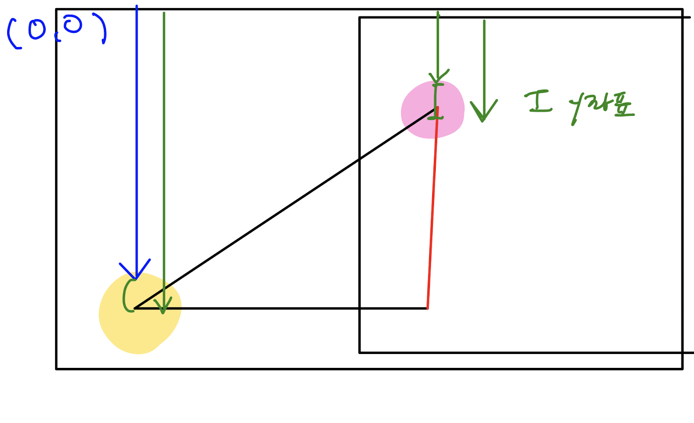

`Team project`
## 'Windmill Fox' 러닝액션 게임 개발

> [게임플레이](http://pyy777053.dothome.co.kr/Team_project_game)   
> 📌 **오직 키보드로만 플레이 가능합니다. 방향키와 엔터키를 사용해 주세요.** <br>
> [개발보고서](https://github.com/0-un/windmill-fox/blob/main/%EA%B2%8C%EC%9E%84%EA%B0%9C%EB%B0%9C%EA%B8%B0%ED%9A%8D%EC%84%9C.pdf)    
	[시연영상](https://youtu.be/hGnshJBzJT0)   
👆 상세 내용은 해당 링크들을 통해 확인해주세요!

## 프로젝트 소개 (2022.04.01~2022.07.18)
- 장르 : 사이드 스크롤 러닝 액션 게임 + 코믹
- 기존의 러닝 액션 게임인 [쿠키런](https://www.youtube.com/watch?v=IwQyv-izgtA)과 코믹 게임 [사--슴 시뮬레이터](https://www.youtube.com/watch?v=xBI0BmmUVvQ)를 벤치마킹 하여 코믹 요소를 가미한 러닝 액션 게임
- 유저들이 예상불가한 캐릭터 디자인과 움직임이 특징

## 적용능력단위 

 - 스마트문화앱UX설계, 스마트문화앱UI디자인, 반응형웹구현, OpenAPI&공공데이터활용, 데이터베이스

## 기획의도 
- 훈련 과정에서 익힌 능력단위들을 실제로 적용해보기 위해, 흔한 러닝 게임이 아닌 유저들이 예상치 못하는 개성 있는 게임을 만들어보고자 게임 개발


## 개발 언어 및 기술 
- HTML5, CSS3, Javascript, MySQL, php
- Photoshop, Illustrator, Adobe XD

## 작품상세설명

* 메인 캐릭터 : 모래(morae)
  - 사막여우 캐릭터가 메인이라 이와 연관된 모래에서 따옴


* 줄거리  
  - 사막 여우 모래는 어느날 갑자기 정글 한가운데 떨어진다. 혼란에 빠진 모래는 고향인 사막을 찾기 위해 모험을 떠나게 된다.
   

* 주요 컨셉 및 특징
  - 코믹 요소에 90% 치충되어 있으며, 유저들이 예상이 불가한 캐릭터들의 움직임과 개성 있는 캐릭터 디자인이 특징
  - 정글 => 북극 => 사막 순으로 단계가 진행되며 점점 속도가 증가하고 HP가 소모된다.

* 주요 아이템
  - 빨간 사과 : HP 20% 회복
  - 황금 사과 : HP 50% 회복
  - 초록 개구리 : 점수 10점 획득
  - 블루 개구리 : 점수 20점 획득
  - 무지개 개구리 : 변신 fever time


## 담당 직무
- Illustrator, HTML5, CSS3, Javascript 사용
- 콘셉트 공동 기획
- 메인 캐릭터 및 아이템 디자인
- 시작 페이지 디자인 및 퍼블리싱
- Javascript를 사용한 러닝 액션 구현
- 아이템과의 충돌 검사
- hp가 소모되는 게이지바 구현

## 구현 기능
**S_main.js**에서 퍼블리싱 파트 작업
- **시작 페이지** : 이미지를 활용한 퍼블리싱 및 `setTimeout`을 사용하여 메인 타이틀 동적 구현


**S_game.js**에서 게임 플레이 공동 작업

*  **러닝 액션**  : 각 캐릭터 모드를 `switch문`을 사용하여 지정
   - **배경** : x 좌표를 감소시켜 각 배경을 다른 속도로 이동하여 러닝 액션을 구현. 또한, 플레이 배경이 특정 x 좌표를 초과했을 때 좌표 값을 바꾸어 맨 뒤에 배치 되도록 이동
   - **기본모드(회전)** : 회전하는 동작 구현. 회전하는 캐릭터 이미지 프레임의 번호를 변수로 지정하고, `if문`을 사용하여 마지막 프레임이 아닐 시 프레임 번호를 증감시켜 캐릭터를 회전
   - **점프** : 점프하는 동작 구현. `if문`을 사용하여 최고점의 점프 이미지 프레임 수 이하이면 캐릭터의 y 좌표를 감소시켜 캐릭터가 상승하도록 구현하고, 최고점의 점프에 도달했을 경우 y좌표를 증감하여 하강하도록 구현. 또한, 하강했을 시 프레임 변수를 초기화 시키고 캐릭터 모드를 기본 모드로 변경
   - **슬라이드** :  슬라이드 동작 구현. `if문`을 사용하여 슬라이드 이미지 프레임의 수가 최대치가 되면 해당 이미지를 고정시켜 슬라이드를 유지 및 아이템 충돌
   - **일시정지** : `ESC키`를 누르면 일시정지 구현.  `clearInterval`을 사용해서 진행되는 게임을 정지
* **아이템 충돌 검사** 
  - **아이템 획득** : 아이템과 부딪히면 아이템 이미지 삭제, 수학적 개념인 `피타고라스 정리`를 활용하여 캐릭터와 아이템을 각각 원으로 지정하여 두 원의 거리가 두 원의 반지름의 합 보다 작을 시 아이템 제거. 해당 동작을 실행하기 위해, 먼저 `(현재의 배경 좌표 + 아이템의 현 x좌표 + 아이템 반지름 길이) - (캐릭터의 현 좌표 + 캐릭터 반지름 길이)`를 통해 두 원 사이의 x, y 좌표의 거리 범위를 구한 뒤 제곱을 하고 `Math.sqrt`로 루트 계산을 하여 두 원의 거리를 구하고 `(캐릭터 반지름 길이 + 아이템 반지름 길이)`의 합 보다 작을 때 `css`로 `display:  'none'` 적용
  - **게임오버** : 바닥 사이에 떨어질 시 게임오버, 캐릭터와 바닥의 양 x좌표를 구해 바닥의 영역에 캐릭터가 충돌하면 캐릭터 y좌표를 증감시켜 하강시킨 후 `clearInterval`을 사용해서 진행되는 게임을 정지, 바닥과 바닥 사이에 충돌된 경우를 위해 이전 바닥의 x좌표와 현재 바닥의 x좌표 사이에 충돌될 경우에도 적용. 또한 `점프 모드` 시에는 점프 프레임 수가 최대 값인지 조건 확인 후 적용
  <br>
  -> 당시 알고리즘을 고민할 때 그린 이미지


* **캐릭터 이미지 배치**: 기존에 생성한 `DOM 태그`를 불러오고 `appendChild`를 이용하여 `div` 안에 캐릭터 이미지를 그려 화면에 출력
* **게임 맵** : 2차원 배열을 이용하여, 아이템 배치를 구현하는 배열이 끝날 때 마다 이후 다른 배열이 오도록 하여 게임의 맵을 구현
* **HP 게이지 바** : HP가 감소됨에 따라 전체 HP 값에서 현재 hp만큼을 width로 지정, css에서 width를 변수 값으로 유동적으로 동작되게 구현
* **점수 획득** : 아이템 획득 시 점수 증가, 아이템 별 점수를 지정 후  `switch문`을 사용하여 각 아이템 획득 시 점수를 누적시켜 표시


## 배운 점 & 아쉬운 점

> **배운 점**
* 프로젝트의 시작,  `Javascript`를 처음 시작할 때 너무 어려워 게임 개발을 하다 오신 현 프로젝트 팀장님께 계속 질문을 한게 인연이었다. 공부를 할 겸 같이 게임 프로젝트를 만드는게 어떠냐고 권유를 하셔서 같이 공부하던 팀원끼리 프로젝트를 시작하게 되었다. 겨우 조건문 기본 개념 정도를 알기 시작할 때 이 프로젝트를 시작했으며 4개월 간 눈에 띈 성장을 했다고 주변에서도, 스스로도 많은 실감을 하고 있다. 
* 프로젝트 초기에 게임 캐릭터를 정할 때, 팀원 각자 메인 캐릭터를 그려와 제일 괜찮은 캐릭터를 선택하기로 했는데 내 캐릭터가 선택되어 한동안 캐릭터 디자인을 했다. 개발을 위해 시작한 프로젝트였는데 직접 캐릭터 디자인도 하고, 시작 페이지 디자인과 퍼블리싱도 맡았다. 처음 접하는 분야라 힘들기도 했지만, 단순히 개발 뿐만이 아닌 색다른 경험을 할 수 있었고, 게임의 구성요소들이 내 손끝에서 탄생한다는 희열감도 느낄 수 있었다. 
* x좌표와 y좌표, 처음 게임 개발을 시작할 때 제일 혼동되었던 부분이다. 당연히 x좌표처럼 값이 증감하면 위치가 올라갈 것이라 생각했는데, y좌표는 증감할 수록 캐릭터의 높이가 내려간다는 것을 의식적으로 생각을 하기가 꽤 어려웠다. 하지만 덕분에 화면 상의 x, y좌표 개념을 알게 되었다.
* 짝 코딩, 5분마다 번갈아 가며 코딩을 한 건 아니지만 대부분의 공동 작업은 같은 프론트엔드 팀원과 함께 팀장님께 동일한 과제를 받고 함께 고민하며 코딩을 했다. 같이 개발을 하며 알고리즘을 공유하고 함께 고민해 나가면서 생각지 못한 알고리즘을 깨닫게 되거나 또는 알려주는 개발 방식을 거치며, 혼자 개발할 때와 달리 의지가 되는 팀원들 덕분에 협업의 장점을 체감하게 되었다.
* 수학적 사고, 코딩을 하면서도 수학의 필요성을 많이 느끼게 되었다. 피타고라스의 정리를 사용하여 아이템 충돌 검사를 할 때, 수학 공식을 적용하여 이해하는 과정이 어려워 계속 그림을 그려가며 알고리즘을 생각했던 기억이 난다. 이후, [사용자의 범위를 계산하여 QR 인증을 하는 프로젝트](https://github.com/0-un/gps_api_munwha)에서도 해당 코드를 응용하여 개발을 완성할 수 있었. 다른 분야에서도 응용이 되고 활용할 수 있음을 깨닫게 되며, 장기간의 프로젝트로 힘들었던 마음을 다시 한 번 다 잡고 열심히 개발할 수 있는 계기가 되었다.
* ```4개월의 기간 동안 다른 프로젝트들과 병행하며 늦은 저녁까지 남아 프로젝트를 진행함에 많이 힘도 들었지만, 플레이만 해봤던 게임을 기획, 디자인, 퍼블리싱, 개발까지 전반적으로 작업하며 프로젝트에 많은 애정을 쏟았고 배우는 것도 많은 값진 프로젝트였다고 생각한다. 처음으로 사용자들이 즐길 수 있는 개발을 하게 된 소중한 경험이 되었다.```


> **아쉬운 점**
* 게임을 개발하면서 수학적 사고력이 많이 필요하다는 것을 느꼈다. 개발을 하려면 여러 분야에 대한 관심을 놓지 말아야겠다고 생각했으며 스스로 더 성장을 하기 위해 끊임없이 노력해야겠다고 생각했다.
* 계속해서 다른 프로젝트와 병행하면서 진행해서 시간이 많이 부족했다. 조금만 더 시간이 많았으면 더 개발하며 배울 수 있는 것이 많았을 거란 아쉬움이 남는다.
* 스스로의 성장도 느꼈지만 동시에 많은 부족함을 느꼈다. 언어 뿐만 아니라 알고리즘과 관련한 많은 공부도 필요하다고 생각하였다.
 


